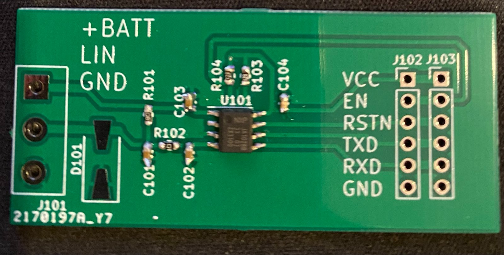
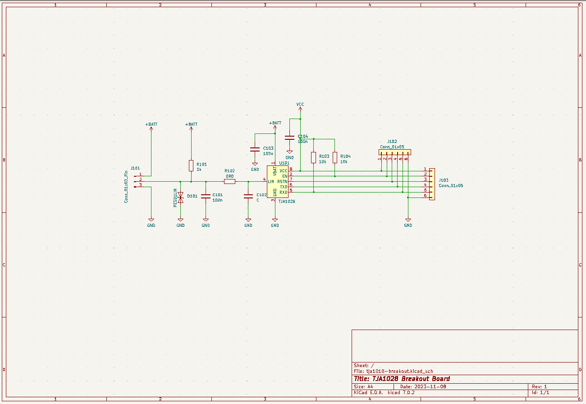

# TJA1028 Breakout board

This breakout board provides a simple method to use a TJA1028T LIN transceiver with any microcontroller or development board (ie. Arduino, NodeMCU)

## Picture of the Board

## Schematics

